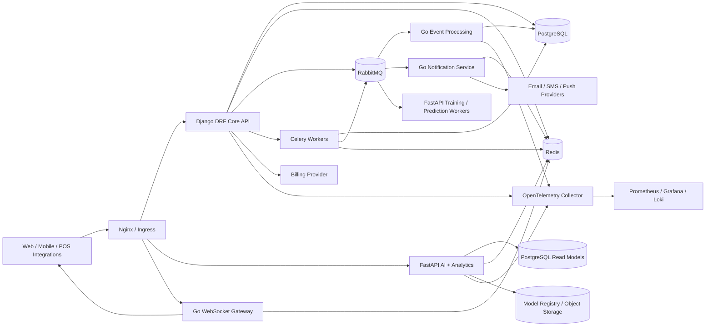
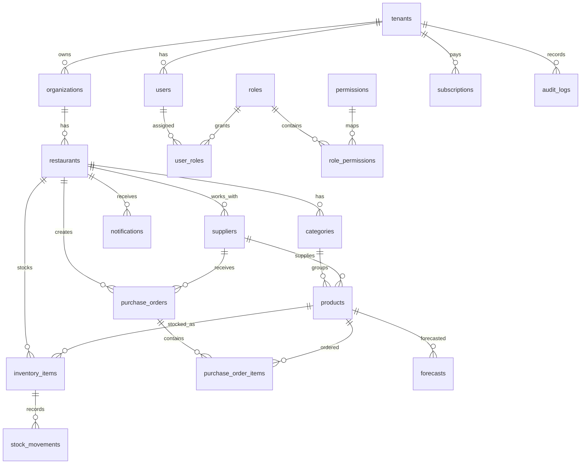

# Smart Inventory Management for Restaurants - Backend Architecture

## 1. Architecture Overview

Smart Inventory Management is a multi-tenant SaaS platform for restaurant inventory, supplier purchasing, demand forecasting, waste reduction, expiration tracking, profitability analytics, auditability, and subscription billing.

The backend is split by workload:

- **Django + DRF** owns the core transactional SaaS domain: tenants, organizations, users, restaurants, RBAC, suppliers, products, inventory, purchase orders, billing, audit logs, and REST APIs.
- **FastAPI** owns AI and analytics APIs: demand forecasting, stockout prediction, waste prediction, seasonal trends, supplier recommendation, and analytic read models.
- **Go** owns high-throughput services: event consumers, notifications, WebSocket gateway, and reporting workers.
- **PostgreSQL** is the primary transactional store.
- **Redis** is used for cache, rate limiting, Celery broker cache, WebSocket presence, idempotency keys, and short-lived query results.
- **RabbitMQ** is the integration backbone for domain events and asynchronous processing.
- **Celery** runs Django background jobs such as purchase order automation, report scheduling, expiration scans, and billing synchronization.
- **Nginx** is the public ingress reverse proxy.

### System Architecture Diagram



### Service Boundaries

| Boundary | Technology | Owns | Does not own |
|---|---|---|---|
| Core SaaS API | Django DRF | Transactional writes, RBAC, tenancy, inventory, purchase orders, billing, audit logs | ML training, long-running event fanout, WebSocket connection state |
| AI Analytics | FastAPI | Forecasting APIs, model training, feature generation, analytic read endpoints | Core transactional writes |
| Realtime + Events | Go | RabbitMQ consumers, notifications, WebSocket fanout, reporting jobs | User auth source of truth, billing source of truth |
| Workers | Celery | Scheduled domain tasks, retries, slow transactional workflows | Public API serving |

### Communication Flow

- Public clients call REST endpoints through Nginx.
- Django validates JWTs, tenant context, RBAC permissions, and writes transactional data.
- Django publishes domain events to RabbitMQ after successful database commit.
- Go consumers handle low-latency notifications, WebSocket broadcasting, and high-throughput reporting.
- FastAPI consumes historical inventory and order data through read models or controlled database views, then serves predictions to Django and clients.
- Celery handles scheduled tasks: expiration alerts, low-stock checks, replenishment recommendations, forecast refreshes, and billing sync.

### Data Flow

1. A restaurant records stock movement through `POST /api/v1/inventory/stock-movements`.
2. Django validates tenant access, writes `stock_movements`, updates `inventory_items`, appends `audit_logs`, and publishes `StockUpdated`.
3. Go event service consumes `StockUpdated`, detects websocket subscribers, and broadcasts inventory deltas.
4. Django/Celery evaluates stock threshold and publishes `StockLow` if needed.
5. FastAPI forecasting workers consume inventory history and purchase order history to refresh demand forecasts.
6. Django uses forecasts to produce replenishment recommendations and optional purchase order drafts.

### Scalability Strategy

- Horizontally scale stateless Django, FastAPI, and Go pods.
- Use PostgreSQL read replicas for analytics reads and reporting exports.
- Partition large event-like tables by month and tenant hash where needed.
- Use RabbitMQ topic exchanges with multiple consumer groups for independent scaling.
- Use Redis for hot tenant settings, product catalog lookups, stock summaries, rate limits, and websocket presence.
- Use Kubernetes HPA based on CPU, request latency, queue depth, and custom metrics.
- Keep AI training asynchronous; serving endpoints should load versioned models at startup or from a model cache.

### Multi-Tenancy Strategy

Use **shared database, shared schema, tenant discriminator** for the first 10,000+ restaurants:

- Every tenant-owned table has `tenant_id`.
- Every API request resolves tenant from JWT claims and/or `X-Tenant-ID`.
- Django middleware stores `tenant_id` in request context.
- Querysets are scoped by tenant at repository/selector level.
- PostgreSQL Row Level Security can be enabled for defense in depth.
- Unique constraints include `tenant_id` where business keys must be tenant-local.
- Large tenants can later be moved to a dedicated database using the same domain model.

## 2. Service Diagram

```mermaid
flowchart TB
  subgraph Django Services
    Auth[Authentication]
    RBAC[Authorization + RBAC]
    Org[Organizations + Restaurants]
    Inv[Inventory]
    Sup[Suppliers]
    PO[Purchase Orders]
    Billing[Billing + Subscriptions]
    Audit[Audit Logs]
  end

  subgraph FastAPI Services
    Forecast[Demand Forecasting]
    Predict[Inventory / Waste Prediction]
    Reco[Recommendation Engine]
    Analytics[Analytics APIs]
  end

  subgraph Go Services
    Notify[Notification Service]
    Events[Event Processing]
    WS[WebSocket Gateway]
    Reports[Reporting Service]
  end

  Django Services --> RabbitMQ[(RabbitMQ)]
  RabbitMQ --> FastAPI Services
  RabbitMQ --> Go Services
  Django Services --> Postgres[(PostgreSQL)]
  FastAPI Services --> Postgres
  Go Services --> Postgres
  Django Services --> Redis[(Redis)]
  FastAPI Services --> Redis
  Go Services --> Redis
```

### Microservice Breakdown

| Service | Responsibility | Database ownership | Endpoints | Communication | Scaling |
|---|---|---|---|---|---|
| Django Authentication | JWT login, refresh, password reset, invitations | `users`, refresh token blacklist | `/api/v1/auth/*` | REST, RabbitMQ `UserInvited` | Scale with API traffic |
| Django Authorization | RBAC, permissions, tenant isolation | `roles`, `permissions`, `user_roles` | `/api/v1/roles`, `/api/v1/permissions` | Internal service layer | Cache permissions in Redis |
| Django Organizations | Tenants, organizations, restaurants | `tenants`, `organizations`, `restaurants` | `/api/v1/organizations`, `/api/v1/restaurants` | REST, domain events | Scale with writes |
| Django Suppliers | Supplier profiles, contracts, lead times | `suppliers` | `/api/v1/suppliers` | REST | Cache supplier lists |
| Django Inventory | Products, categories, items, stock movements, expiration | `products`, `categories`, `inventory_items`, `stock_movements` | `/api/v1/products`, `/api/v1/inventory/*` | REST, RabbitMQ stock events | Partition movement table |
| Django Purchase Orders | PO lifecycle and approvals | `purchase_orders`, `purchase_order_items` | `/api/v1/purchase-orders` | REST, RabbitMQ order events | Async approvals and exports |
| Django Billing | Plans, subscriptions, usage, billing provider sync | `subscriptions` | `/api/v1/subscriptions` | REST, webhooks | Isolate webhook workers |
| Django Audit Logs | Immutable action trail | `audit_logs` | `/api/v1/audit-logs` | Event append | Partition by month |
| FastAPI Demand Forecasting | Daily/weekly/seasonal demand forecasts | `forecasts`, model metadata | `/api/v1/forecasts/*` | REST, RabbitMQ `ForecastGenerated` | CPU/memory HPA |
| FastAPI Prediction | Stockout, spoilage, waste risk | `forecasts`, analytic read models | `/api/v1/predictions/*` | REST | Model-serving replicas |
| FastAPI Recommendation | Replenishment and supplier recommendations | Read-only product/supplier/order views | `/api/v1/recommendations/*` | REST to Django, RabbitMQ | Scale by tenant load |
| FastAPI Analytics | Profitability and waste analytics | Read models/materialized views | `/api/v1/analytics/*` | REST | Read replicas |
| Go Notification | Email/SMS/push/in-app notifications | `notifications` write through repository | Internal `/healthz`; consumes events | RabbitMQ, Redis | Scale by queue depth |
| Go Event Processing | Event validation, routing, idempotency | `event_inbox`, `event_outbox` | Internal only | RabbitMQ | Consumer group scale |
| Go WebSocket Gateway | Realtime inventory and alert updates | Redis presence only | `/ws/v1/restaurants/{id}` | WebSocket, Redis pub/sub | Many small replicas |
| Go Reporting | High-performance exports and aggregates | Read replicas, report files | `/api/v1/reports/*` | REST, async jobs | Scale separate worker pool |

## 3. Database Design

### ERD



### Core Tables

The canonical PostgreSQL schema is in `docs/database/smart_inventory_schema.sql`.

Key design choices:

- IDs use UUID primary keys.
- `tenant_id` is required on tenant-owned rows.
- Monetary values use `numeric(12,2)`.
- Quantity values use `numeric(14,4)` to support grams, liters, cases, and units.
- Large append-only tables use monthly range partitioning: `stock_movements`, `audit_logs`, and `notifications`.
- Core lookup uniqueness is scoped to tenant or restaurant.
- Foreign keys use restrictive deletes for financial/order data and soft deletes for business entities.

### Indexes

- `tenant_id` on all tenant-owned tables.
- Composite indexes for hot filters:
  - `(tenant_id, restaurant_id, product_id)` on inventory.
  - `(tenant_id, restaurant_id, occurred_at desc)` on stock movements.
  - `(tenant_id, restaurant_id, status, created_at desc)` on purchase orders.
  - `(tenant_id, restaurant_id, expires_at)` on expiring inventory.
  - `(tenant_id, entity_type, entity_id, created_at desc)` on audit logs.
- Partial indexes:
  - low stock: `WHERE quantity_on_hand <= reorder_point`.
  - unread notifications: `WHERE read_at IS NULL`.

## 4. Django Structure

```text
backend/
  manage.py
  config/
    settings/
      base.py
      local.py
      production.py
      test.py
    urls.py
    asgi.py
    wsgi.py
    celery.py
  core/
    db/
    events/
    exceptions.py
    middleware.py
    pagination.py
    permissions.py
    throttling.py
    utils.py
  apps/
    accounts/
      models.py
      serializers.py
      services.py
      repositories.py
      selectors.py
      permissions.py
      views.py
      urls.py
      tests/
    organizations/
    restaurants/
    inventory/
    suppliers/
    orders/
    subscriptions/
    notifications/
    analytics/
    audit/
  requirements/
    base.txt
    local.txt
    production.txt
  tests/
```

Every Django app should follow this split:

- `models.py`: persistence models only.
- `repositories.py`: write queries and transaction boundaries.
- `selectors.py`: read queries and filtering.
- `services.py`: business workflows and event publication.
- `serializers.py`: request/response validation.
- `permissions.py`: tenant and RBAC checks.
- `views.py`: thin DRF viewsets.
- `tests/`: model, service, API, permission, and event tests.

Recommended packages:

- `djangorestframework`
- `djangorestframework-simplejwt`
- `drf-spectacular`
- `django-filter`
- `django-cors-headers`
- `django-redis`
- `celery`
- `psycopg`
- `django-storages`
- `stripe`
- `opentelemetry-*`

## 5. FastAPI Structure

```text
ai-service/
  app/
    main.py
    api/
      v1/
        forecasts.py
        predictions.py
        recommendations.py
        analytics.py
    core/
      config.py
      security.py
      observability.py
    domain/
      forecasting.py
      recommendations.py
    schemas/
      forecasts.py
      predictions.py
    services/
      feature_engineering.py
      training.py
      prediction.py
      model_registry.py
    repositories/
      inventory_repository.py
      forecast_repository.py
    workers/
      train_models.py
      consume_events.py
    tests/
  requirements.txt
  Dockerfile
```

### Prediction Pipeline

1. Load historical stock movements, sales/POS imports, purchase orders, waste records, weather/seasonality features where available.
2. Normalize units and remove outliers.
3. Build features: day of week, month, holiday flag, menu category, supplier lead time, recent moving averages, waste ratio, stockout count.
4. Train baseline model per restaurant/category/product:
   - MVP: `RandomForestRegressor`, `GradientBoostingRegressor`, or `HistGradientBoostingRegressor`.
   - Later: hierarchical forecasting, Prophet-like seasonality, or deep learning if justified.
5. Persist model metadata and forecast rows.
6. Serve daily and weekly demand through low-latency REST endpoints.

## 6. Go Structure

```text
go-services/
  cmd/
    notification/
      main.go
    websocket-gateway/
      main.go
    reporting/
      main.go
    event-processor/
      main.go
  internal/
    domain/
      event.go
      notification.go
      report.go
    ports/
      event_bus.go
      notification_sender.go
      repository.go
    adapters/
      rabbitmq/
      postgres/
      redis/
      email/
      sms/
      websocket/
    application/
      notification_service.go
      reporting_service.go
      event_router.go
    config/
    observability/
    tests/
```

Use hexagonal architecture:

- Domain is provider-agnostic.
- Ports define interfaces.
- Adapters implement RabbitMQ, PostgreSQL, Redis, email, SMS, push, and WebSocket.
- Application services orchestrate use cases.
- Dependency injection is constructor based; use `wire` or simple manual composition.

## 7. API Specifications

The OpenAPI seed contract is in `docs/api-specs/smart-inventory-openapi.yaml`.

### Endpoint Groups

- `POST /api/v1/auth/login`
- `POST /api/v1/auth/refresh`
- `GET /api/v1/organizations`
- `GET /api/v1/restaurants`
- `GET /api/v1/suppliers`
- `GET /api/v1/products`
- `GET /api/v1/inventory/items`
- `POST /api/v1/inventory/stock-movements`
- `GET /api/v1/purchase-orders`
- `POST /api/v1/purchase-orders`
- `POST /api/v1/purchase-orders/{id}/approve`
- `GET /api/v1/forecasts/daily`
- `GET /api/v1/recommendations/replenishment`
- `GET /api/v1/analytics/profitability`
- `GET /api/v1/audit-logs`

### API Standards

- Version prefix: `/api/v1`.
- Pagination: `limit`, `offset`, response `count`, `next`, `previous`, `results`.
- Filtering: `?restaurant_id=...&status=...&created_at_after=...`.
- Sorting: `?ordering=-created_at,name`.
- Error format:

```json
{
  "error": {
    "code": "validation_error",
    "message": "Invalid request payload.",
    "details": {"quantity": ["Must be greater than zero."]},
    "request_id": "req_01HX..."
  }
}
```

## 8. Event Architecture

RabbitMQ topology:

- Exchange: `smart_inventory.events` topic exchange.
- Dead-letter exchange: `smart_inventory.dlx`.
- Retry exchange: `smart_inventory.retry`.
- Queues:
  - `notifications.stock`
  - `forecasting.inventory`
  - `reporting.movements`
  - `audit.events`
  - `billing.events`

### Event Contracts

All events use this envelope:

```json
{
  "event_id": "01HXZ9T7M4J9A6T2FXZY5CQ5VG",
  "event_type": "StockUpdated",
  "event_version": 1,
  "tenant_id": "9a0b6a7e-3a6b-4e3a-b44f-8ecf69a4e300",
  "restaurant_id": "ea86d1ae-e9cf-4770-8a15-86bb553a7b1c",
  "occurred_at": "2026-06-11T09:00:00Z",
  "correlation_id": "req_01HXZ9...",
  "producer": "django.inventory",
  "payload": {}
}
```

Events:

- `StockCreated`
- `StockUpdated`
- `StockLow`
- `PurchaseOrderCreated`
- `PurchaseOrderApproved`
- `ForecastGenerated`
- `WasteDetected`
- `UserInvited`
- `SubscriptionChanged`
- `ExpirationApproaching`

### Retry Strategy

- Consumers are idempotent using `event_id`.
- Retry with exponential backoff: 30 seconds, 2 minutes, 10 minutes.
- After max attempts, route to dead-letter queue.
- DLQ payload includes failure reason, stack summary, consumer name, and retry count.
- Poison messages are replayed only through an explicit admin action.

## 9. Deployment Architecture

Production deployment artifacts are in:

- `docs/devops/docker-compose.production.yml`
- `docs/devops/kubernetes.yaml`

Baseline runtime:

- Nginx ingress
- Django API pods
- Celery worker pods
- Celery beat pod
- FastAPI pods
- Go notification pods
- Go websocket pods
- Go reporting pods
- PostgreSQL managed cluster
- Redis managed cluster
- RabbitMQ cluster
- OpenTelemetry collector
- Prometheus, Grafana, Loki

## 10. Security Architecture

- JWT access tokens with short TTL.
- Refresh token rotation and blacklist.
- Tenant ID is embedded in JWT and verified against user membership.
- RBAC checks are enforced in view permissions and service methods.
- PostgreSQL RLS can enforce tenant boundaries at database level.
- API rate limiting by tenant, user, and IP.
- CSRF enabled for browser session endpoints; JWT APIs use Authorization headers.
- Password hashing through Django defaults or Argon2.
- Secrets through environment variables and Kubernetes secrets.
- CORS allowlist per environment; no wildcard in production.
- Audit logs for all sensitive writes and access to financial/export data.
- OWASP protections: input validation, secure headers, least privilege DB users, no raw SQL without parameters, structured error responses, and dependency scanning.

## 11. CI/CD Architecture

GitHub Actions pipeline:

1. Lint Python, Go, YAML, and Dockerfiles.
2. Run Django tests with PostgreSQL and Redis.
3. Run FastAPI tests.
4. Run Go unit and integration tests.
5. Build Docker images.
6. Run vulnerability scans.
7. Publish images to registry.
8. Deploy to staging through Kubernetes.
9. Run smoke tests.
10. Promote to production after approval.

The workflow seed is in `.github/workflows/ci.yml`.

## 12. Development Roadmap

### Phase 1 - Foundation

- Replace demo Django `api` app with modular apps.
- Add JWT auth, tenant middleware, RBAC, and audit logging.
- Implement PostgreSQL schema and migrations.
- Add OpenAPI generation with `drf-spectacular`.
- Add Docker Compose with PostgreSQL, Redis, RabbitMQ.

### Phase 2 - Core Inventory

- Implement products, categories, suppliers, inventory items, and stock movements.
- Add stock threshold detection and expiration alerts.
- Publish stock domain events with transactional outbox.
- Add API tests and service tests.

### Phase 3 - Purchasing

- Implement purchase order lifecycle.
- Add approval workflow and supplier lead-time tracking.
- Add replenishment recommendation drafts.
- Add notification consumers.

### Phase 4 - AI + Analytics

- Build FastAPI forecasting service.
- Create feature engineering and model training jobs.
- Add forecast tables and APIs.
- Add profitability, waste, and stockout analytics.

### Phase 5 - Realtime + Reporting

- Build Go WebSocket gateway.
- Build Go reporting service.
- Add materialized views and export jobs.
- Add queue-depth based autoscaling.

### Phase 6 - Production Hardening

- Add RLS, full observability, alerts, backups, restore drills, load tests, chaos tests, and SLO dashboards.
- Tune partitions and read replicas for high-volume tenants.
- Complete security review and compliance documentation.
